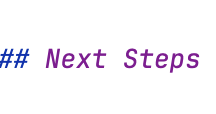

# Introduction to PostgreSQL Indexes

Indexes are one of the most powerful features in PostgreSQL for optimizing query performance. They work similarly to an index in a book, allowing the database to find data without scanning the entire table.

## Why Indexes Matter

Without indexes, PostgreSQL must perform a sequential scan of all rows in a table to find matching records. This becomes increasingly inefficient as your tables grow in size.

Consider this query:

```sql
SELECT * FROM users WHERE email = 'user@example.com';
```

Without an index on the `email` column, PostgreSQL would need to check every single row in the `users` table.

## How Indexes Work

Indexes create a separate data structure that is optimized for quick lookups. When you create an index, PostgreSQL:

1. Extracts the indexed column(s) and row pointers
2. Sorts this data
3. Stores it in a specialized data structure (typically a B-tree)

This allows the database to use efficient search algorithms to locate data quickly.

## Types of Indexes in PostgreSQL

PostgreSQL offers several index types, each optimized for different scenarios:

- **B-tree**: The default index type, good for equality and range queries
- **Hash**: Optimized for equality comparisons only
- **GiST**: Generalized Search Tree, useful for full-text search and geometric data
- **GIN**: Generalized Inverted Index, great for indexing arrays and JSON data
- **BRIN**: Block Range Index, efficient for large tables with naturally ordered data

## When to Use Indexes

Indexes are most beneficial when:

- Tables are large
- Columns are frequently used in WHERE clauses
- Columns have high cardinality (many unique values)
- Columns are used in JOIN conditions

## When to Avoid Indexes

Indexes aren't always beneficial:

- They add overhead to write operations (INSERT, UPDATE, DELETE)
- They consume disk space
- Small tables may not benefit from indexing
- Columns with low cardinality might not benefit from standard indexes

## Next Steps

In the next section, you'll learn how to create your first index and measure its performance impact. 

